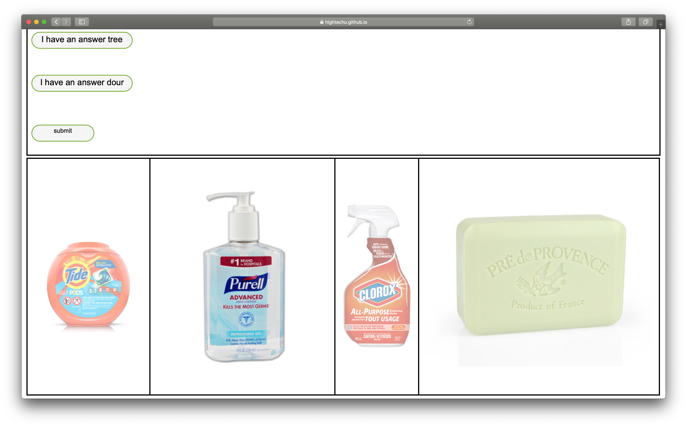

# Question & Answer

**2019 HighTechU Academy - Cohort 1**

## Website

[Live Demo](https://hightechu.github.io/hightechu-academy-questionanswer/)

## Problem Statement

Its a storymode game where the user goes through different questions and learns about hygiene.

## User Stories

* As a user, I want to be able to see the rules of the game clearly.
* As a user, I want to be able to see all questions clearly.
* As a user, I want to be able to select an option from given options.
* As a user, I want to be able to move between different questions.

## Promo

## Made with:

* HTML
* CSS

## Made by:

* Dhuruvan
* Helya
* Jason
* Saafi
